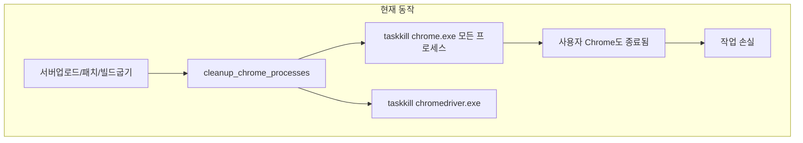
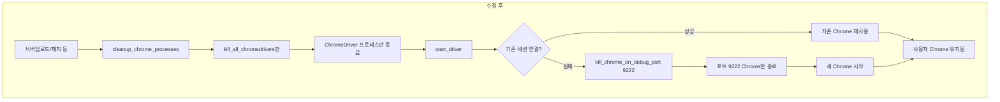

# Chrome 종료 없이 ChromeDriver 실행하도록 수정

## 현재 구조와 문제점



- 앱은 **C:\ChromeTEMP** 전용 프로필로 별도 Chrome 인스턴스를 사용 (포트 9222)
- `taskkill /F /IM chrome.exe`는 **시스템의 모든 Chrome**을 종료함
- 사용자가 다른 용도로 사용 중인 Chrome까지 함께 종료되어 작업 손실 발생

## 해결 방향

1. **ChromeDriver만 정리**: 앱 시작 시 Chrome 전체가 아닌 ChromeDriver 프로세스만 종료
2. **선택적 Chrome 종료**: 기존 세션 연결 실패 시, 포트 9222를 사용하는 Chrome만 종료

## 수정 대상 파일

### 1. [core/aws_manager.py](core/aws_manager.py)

**변경 1: `cleanup_chrome_processes()` 수정 (566~601행)**

- Chrome 프로세스 종료 코드 제거
- ChromeDriver 종료만 수행 (`kill_all_chromedrivers()` 호출)
- 함수 목적에 맞게 동작하도록 수정 (필요 시 `cleanup_chromedriver_processes` 등으로 이름 변경 가능)

```python
# 변경 전: Chrome + ChromeDriver 모두 종료
# 변경 후: ChromeDriver만 종료 (Chrome은 건드리지 않음)
```

**변경 2: `start_driver()` 내 선택적 종료 (691~694행)**

- 기존: `taskkill /F /IM chrome.exe` → 전체 Chrome 종료
- 변경: 포트 9222를 사용하는 프로세스만 종료하는 헬퍼 추가 후 해당 경우에만 사용

새 헬퍼 함수 예시:

```python
def kill_chrome_on_debug_port(port=9222):
    """포트 9222를 사용하는 Chrome 프로세스만 종료 (앱 전용 C:\ChromeTEMP 인스턴스)"""
    # netstat -ano로 포트 사용 PID 조회 후, chrome.exe인 경우만 taskkill /PID
```

- `psutil` 사용 시 `psutil.AccessDenied` 가능성이 있으므로, `netstat` 기반 fallback 포함 권장

**변경 3: 호환성**

- `cleanup_chrome_processes()` 시그니처 유지 → 기존 호출부 수정 불필요
- 내부 구현만 Chrome 종료 제거 + ChromeDriver만 종료로 변경

### 2. [index.py](index.py)

**변경: 서버업로드및패치 직전 Chrome/ChromeDriver 종료 제거 (1319~1322행)**

- 현재: `taskkill chrome.exe`, `taskkill chromedriver.exe` 직접 호출
- 변경: Chrome 종료 제거, ChromeDriver만 정리 (`AWSManager.kill_all_chromedrivers()` 사용)
- `upload_server_build()` 내부 `cleanup_chrome_processes()`가 이미 ChromeDriver만 정리하도록 바뀌므로, 이 구간에서는 ChromeDriver 정리만 수행

```python
# 변경 전
os.system('taskkill /F /IM chrome.exe /T 2>nul')
os.system('taskkill /F /IM chromedriver.exe /T 2>nul')

# 변경 후
AWSManager.kill_all_chromedrivers()
```

### 3. "Chrome프로세스정리" 옵션 (index.py 1388~1417행)

- 사용자가 명시적으로 실행하는 기능이므로 **현재대로 유지**
- Chrome 및 ChromeDriver 모두 종료하는 정리 동작을 원할 때 사용

## 데이터 흐름 (수정 후)



## 주의사항

- 앱 Chrome은 `C:\ChromeTEMP` 프로필 사용, 사용자 Chrome은 기본 프로필 사용
- 포트 9222는 앱 전용 Chrome만 사용하므로, 해당 포트의 프로세스만 종료해도 안전
- `cleanup_chrome_processes` 호출 위치: `upload_server_build`, `update_server_container`, `force_patch_latest_server`, `delete_server_container`, `run_teamcity_build` 등 6곳 → 모두 동일 로직으로 Chrome을 종료하지 않게 됨
