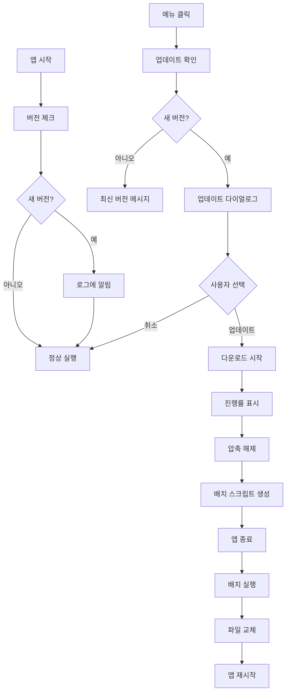

# QuickBuild 자동 업데이트 시스템 가이드

## 📋 개요

QuickBuild에 통합된 자동 업데이트 시스템입니다. GitHub Releases를 통해 새 버전을 확인하고 자동으로 다운로드 및 설치합니다.

## ✨ 주요 기능

### 1. 자동 버전 체크
- 앱 시작 시 백그라운드에서 자동으로 최신 버전 확인
- 새 버전이 있으면 로그에 조용히 알림
- UI 블록 없이 비동기 처리

### 2. 수동 업데이트 확인
- 메뉴 → "업데이트 확인" 클릭
- 현재 버전과 최신 버전 비교
- 릴리즈 노트 표시

### 3. 원클릭 업데이트
- 다운로드 진행률 표시
- 자동 압축 해제
- 배치 스크립트를 통한 안전한 파일 교체
- 앱 자동 재시작

## 🔧 기술 세부사항

### 버전 형식
```
3.0-25.10.27.1635
│   │  │  │  └─── 시간 (HHMM)
│   │  │  └────── 일 (DD)
│   │  └───────── 월 (MM)
│   └──────────── 연도 (YY)
└──────────────── 메이저.마이너
```

### GitHub API
```python
API URL: https://api.github.com/repos/SungMinseok/GetBuild/releases/latest
Repository: SungMinseok/GetBuild
Asset: QuickBuild_*.zip
```

### 업데이트 프로세스



## 📂 파일 구조

### 주요 파일
```
프로젝트/
├── updater.py                    # 업데이트 모듈
├── index_v2.py                   # 메인 앱 (업데이트 통합됨)
├── version.json                  # 현재 버전 정보
└── QuickBuild.exe                # 실행 파일

업데이트 중 생성되는 임시 파일:
├── QuickBuild_update.zip         # 다운로드된 ZIP
├── update_extract/               # 압축 해제 폴더
└── update_installer.bat          # 설치 스크립트 (자동 삭제)
```

### version.json 구조
```json
{
  "version": "3.0-25.10.27.1635",
  "build_date": "2025-10-27",
  "update_url": "https://api.github.com/repos/SungMinseok/GetBuild/releases/latest",
  "changelog": [
    {
      "version": "3.0-25.10.27.1635",
      "date": "2025-10-27",
      "changes": ["기능 개선", "버그 수정"]
    }
  ]
}
```

## 🎯 사용 방법

### 사용자 입장

#### 1. 자동 업데이트 (기본)
1. QuickBuild 실행
2. 로그 패널 확인 → "새 버전 있음: x.x.x" 메시지 확인
3. 메뉴 → "업데이트 확인" 클릭
4. "예" 클릭하여 업데이트 진행
5. 자동으로 재시작됨

#### 2. 수동 업데이트 확인
1. 메뉴 → "업데이트 확인" 클릭
2. 최신 버전이면: "현재 최신 버전을 사용 중입니다." 메시지
3. 새 버전이면: 업데이트 다이얼로그 표시

#### 3. 업데이트 취소
- 다이얼로그에서 "아니오" 클릭
- 다운로드 중 "취소" 버튼 클릭

### 개발자 입장

#### 1. 새 버전 배포

##### A. 자동 배포 (추천)
```bash
# 1. 버전 업데이트
python update_version.py "새로운 기능 추가"

# 2. 빌드
python build_release.py

# 3. GitHub Release 생성 및 업로드
python deploy_github.py
```

또는 한 번에:
```bash
quick_deploy.bat
```

##### B. 수동 배포
```bash
# 1. 버전 수정
# version.json 파일 수정

# 2. 빌드
python build_release.py

# 3. GitHub에 수동 업로드
# dist/QuickBuild_x.x.x.zip을 GitHub Release에 업로드
```

#### 2. 로컬 테스트

##### updater.py 단독 테스트
```bash
python updater.py
```

출력 예시:
```
============================================================
QuickBuild 업데이트 테스트
============================================================

[1] 서버에서 최신 버전 확인 중...
현재 버전: 3.0-25.10.27.1635
최신 버전: 3.0-25.10.27.1640
✅ 새로운 버전 발견: 3.0-25.10.27.1640
   다운로드 URL: https://github.com/.../QuickBuild_3.0-25.10.27.1640.zip
   릴리즈 노트:
   - 버그 수정
   - 성능 개선

업데이트를 진행하시겠습니까? (y/n): y

[2] 다운로드 중...
진행률: 100.0% (50000000/50000000 bytes)
✅ 다운로드 완료

[3] 설치 시작...
✅ 업데이트 테스트 완료!
배치 스크립트가 백그라운드에서 실행 중입니다.
```

## 🔐 보안 및 안정성

### 1. 안전한 다운로드
- HTTPS를 통한 안전한 다운로드
- 다운로드 크기 검증
- 불완전 다운로드 시 자동 삭제

### 2. Windows Defender 호환
- Zone.Identifier 자동 제거
- 다운로드 후 대기 시간 (Defender 스캔)
- 신뢰할 수 있는 배치 스크립트 사용

### 3. 프로세스 안전성
```batch
1. 현재 프로세스 종료 대기 (3초)
2. 강제 종료 (taskkill)
3. 파일 핸들 해제 대기 (5초)
4. 파일 복사 (xcopy)
5. 임시 파일 정리
6. 앱 재시작
7. 배치 스크립트 자동 삭제
```

### 4. 오류 처리
- 네트워크 오류 → 사용자에게 알림
- 다운로드 실패 → 임시 파일 자동 정리
- 설치 실패 → 기존 버전 유지

## ⚙️ 설정

### requirements.txt에 추가된 패키지
```
packaging>=21.0  # 버전 비교용
```

기존 패키지는 그대로 사용:
```
requests>=2.31.0  # HTTP 요청
PyQt5>=5.15.0     # GUI
```

### .gitignore 추가 항목
```
# 업데이트 임시 파일
QuickBuild_update.zip
update_extract/
update_installer.bat
```

## 🐛 문제 해결

### 문제 1: "업데이트 모듈을 불러올 수 없습니다"
**원인**: updater.py 파일이 없거나 import 오류

**해결**:
```bash
# 1. updater.py 존재 확인
dir updater.py

# 2. packaging 패키지 설치 확인
pip install packaging

# 3. 앱 재시작
```

### 문제 2: "다운로드 가능한 QuickBuild ZIP 파일이 없습니다"
**원인**: GitHub Release에 QuickBuild_*.zip 파일이 없음

**해결**:
```bash
# 1. GitHub Release 확인
https://github.com/SungMinseok/GetBuild/releases/latest

# 2. 파일명 확인 (QuickBuild_로 시작하는 .zip 파일)

# 3. 없으면 재배포
python deploy_github.py
```

### 문제 3: 버전 비교 오류
**원인**: 버전 형식이 다름

**해결**:
- version.json의 버전 형식 확인: `3.0-25.10.27.1635`
- GitHub Release의 tag 형식 확인: `v3.0-25.10.27.1635` 또는 `3.0-25.10.27.1635`

### 문제 4: 업데이트 후 앱이 시작되지 않음
**원인**: 파일 복사 실패 또는 권한 문제

**해결**:
```bash
# 1. update_installer.bat 로그 확인 (실행 중 표시됨)

# 2. 수동 복사
# update_extract/ 폴더 내용을 앱 폴더로 복사

# 3. 관리자 권한으로 실행
# QuickBuild.exe 우클릭 → "관리자 권한으로 실행"
```

## 📊 로그 및 디버깅

### 로그 메시지

#### 성공 케이스
```
서버에서 최신 버전 확인 중...
현재 버전: 3.0-25.10.27.1635
최신 버전: 3.0-25.10.27.1640
새로운 버전 발견: 3.0-25.10.27.1640
다운로드 시작: https://github.com/.../QuickBuild_3.0-25.10.27.1640.zip
저장 위치: C:\...\QuickBuild_update.zip
다운로드 크기: 45.23 MB
✅ 다운로드 완료
✅ 압축 해제 완료
✅ 배치 스크립트 생성 완료
🚀 업데이트 설치 스크립트 실행 중...
⚠️ 잠시 후 프로그램이 자동으로 재시작됩니다.
```

#### 최신 버전 케이스
```
서버에서 최신 버전 확인 중...
현재 버전: 3.0-25.10.27.1635
최신 버전: 3.0-25.10.27.1635
현재 최신 버전을 사용 중입니다.
```

#### 오류 케이스
```
서버에서 최신 버전 확인 중...
❌ 네트워크 오류: HTTPSConnectionPool(host='api.github.com', port=443): Max retries exceeded
```

## 🔄 업그레이드 방법 (기존 updater.exe → updater.py)

### 단계별 마이그레이션

#### 1. 기존 파일 정리
```bash
# 더 이상 필요 없는 파일들
del QuickBuild_updater.exe
del QuickBuild_updater.spec
```

#### 2. 새 파일 추가
```bash
# 이미 생성됨
updater.py
```

#### 3. 의존성 설치
```bash
pip install packaging
```

#### 4. 테스트
```bash
# 단독 테스트
python updater.py

# 앱 테스트
python index_v2.py
# → 메뉴 → "업데이트 확인"
```

#### 5. 빌드에 포함
`build_release.py`는 자동으로 `updater.py`를 포함하지 않습니다.
필요 시 spec 파일에 추가:

```python
# build_release.py - create_spec_file() 수정
datas=[
    ('version.json', '.'),
    ('qss', 'qss'),
    ('ico.ico', '.'),
    # updater.py는 별도로 포함하지 않음 (import로 번들링됨)
],
hiddenimports=[
    # ... 기존 imports
    'updater',  # updater 모듈 명시적 포함
    'packaging',
    'packaging.version',
],
```

## 🎓 개발 참고사항

### updater.py 구조

```python
UpdateChecker
├── check_for_updates()      # GitHub API 호출
└── _load_current_version()  # version.json 읽기

UpdateDownloader
├── download()                # ZIP 다운로드
└── cancel()                  # 다운로드 취소

UpdateInstaller
└── install_update()          # 배치 스크립트 생성 및 실행

AutoUpdater (통합 관리자)
├── check_updates_async()     # 비동기 체크
├── check_updates_sync()      # 동기 체크
└── download_and_install()    # 다운로드 + 설치
```

### index_v2.py 통합

```python
from updater import AutoUpdater

class QuickBuildApp:
    def __init__(self):
        self.auto_updater = AutoUpdater()
        self.auto_updater.set_main_app(self)
    
    def check_update(self):
        # 메뉴에서 호출
        has_update, info, error = self.auto_updater.check_updates_sync()
        # ... UI 처리
    
    def start_update_download(self):
        # 다운로드 및 설치
        self.auto_updater.download_and_install(progress_cb, completion_cb)
```

### 배치 스크립트 (update_installer.bat)

```batch
@echo off
chcp 65001 > nul

REM [1/5] 프로세스 종료
taskkill /F /IM QuickBuild.exe

REM [2/5] 파일 복사
xcopy /E /I /H /Y "update_extract\*" "."

REM [3/5] 정리
del QuickBuild_update.zip
rmdir /S /Q update_extract

REM [4/5] 재시작
start "" "QuickBuild.exe"

REM [5/5] 자동 삭제
(goto) 2>nul & del "%~f0"
```

## 📝 체크리스트

### 배포 전
- [ ] version.json 업데이트됨
- [ ] CHANGELOG.txt 작성됨
- [ ] 로컬 빌드 테스트 완료
- [ ] updater.py 단독 테스트 완료
- [ ] GitHub Release 생성 준비됨

### 배포 후
- [ ] GitHub Release 확인
- [ ] ZIP 파일 다운로드 테스트
- [ ] 업데이트 테스트 (구 버전 → 신 버전)
- [ ] 앱 재시작 확인
- [ ] 기능 정상 작동 확인

---

**작성일**: 2025-10-27  
**버전**: 1.0  
**상태**: ✅ 완료 및 테스트 대기

